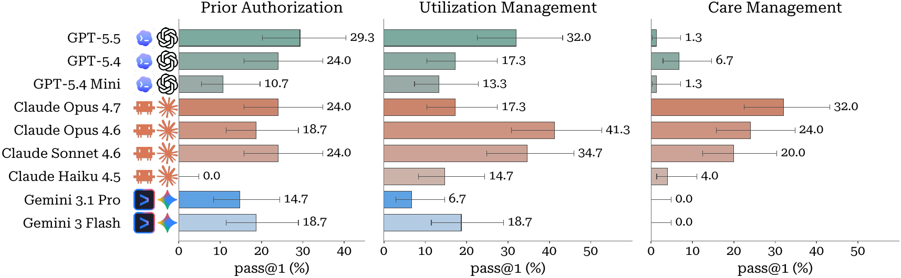

<div align="center">
  
  <h1><ins>C</ins>linical <ins>H</ins>ealthcare <ins>I</ins>n-Situ Environment</h1>
  <p><b>Benchmark for long-horizon, policy-rich healthcare workflow agents</b></p>

[](https://actava.ai/benchmarks/leaderboards)
[](https://actava.ai/benchmarks/docs)
[](https://arxiv.org/pdf/2605.16679)
[](https://huggingface.co/datasets/actava/chi-bench)
[](https://huggingface.co/datasets/actava/managed-care-operations-handbook)
[](https://hub.harborframework.com/datasets/actava-ai/chi-bench)

[](https://discord.gg/eQfMpUQtda)
[](https://join.slack.com/share/enQtMTExMTE4MDYyNTMzOTktMzZiMGE2MjYxYjRmNzYyMTFiMDVkZmJiNzZiYWUwNWMwNzJkMGRiZDIwYmU5ZWM5NDQyY2E2ZDEyNTcxZWQ1ZA)
[](https://drive.google.com/file/d/1FD93bxx4E9C9FZDCQW0o_KoQGi-i8WOa/view?usp=sharing)
[](https://www.linkedin.com/company/actava/)

</div>

## What this benchmark measures

$\chi$-Bench evaluates AI agents on end-to-end U.S. healthcare workflows across three long-horizon domains: provider prior authorization, payer utilization management, and population care management. Each task hands the agent a clinical case in a high-fidelity simulator of 20 healthcare apps exposed over MCP, with a 1,279-document Managed-Care Operations Handbook skills, and asks it to drive the case through tool calls and artifact authoring.

> [!TIP]
> Reading on the web: **[Overview & authors](https://actava.ai/benchmarks/chi-bench)** · **[Live leaderboard](https://actava.ai/benchmarks/leaderboards)** · **[All 75 tasks](https://actava.ai/benchmarks/tasks)** · **[Docs](https://actava.ai/benchmarks/docs)**.

> [!NOTE]
> **Headline numbers from the paper:**
>
> - Best agent (Claude Code + Claude Opus 4.6): **28.0%** overall pass@1
> - No agent clears **20%** on strict pass^3
> - Marathon (all 25 tasks in one session): **3.8%** overall
> - End-to-end provider–payer arena: **0%** on the best PA agents

<p align="center">
  
</p>

| Domain                               | Tasks | What the agent does                                                                                        |
| ------------------------------------ | ----- | ---------------------------------------------------------------------------------------------------------- |
| **Prior Authorization — Provider**   | 25    | Verify coverage, gather evidence, submit the PA packet, work the response (RFIs, peer-to-peer, appeals)    |
| **Prior Authorization — UM (Payer)** | 25    | Intake the request, check plan policy, escalate through nurse and physician reviewers, issue determination |
| **Care Management**                  | 25    | Review the chart, contact the patient, administer assessments, author a care plan                          |

## Setup (one-time)

**Prereqs:** Python 3.12+, Docker, [uv](https://github.com/astral-sh/uv).

**1. Clone and install.**

```bash
git clone https://github.com/actava-ai/chi-bench && cd chi-bench
uv sync --extra dev
```

**2. API keys.** Copy `.env.example` to `.env` and fill in:

- `ANTHROPIC_API_KEY` — **required**. The workspace judge (`claude-opus-4-7`) grades every trial; also the default credential for the Claude Code agent harness.
- `OPENAI_API_KEY` — required for Codex and OAI Agents rows.
- `GEMINI_API_KEY` — required for Gemini CLI rows.
- `OPENROUTER_API_KEY` — required for the open-stack rows (Hermes / OpenClaw / OAI Agents / DeepAgents on open-weight models).
- `CLAUDE_CODE_OAUTH_TOKEN` — _optional_, cheaper alternative for smoke-testing the Claude Code harness. When set, Claude Code authenticates via OAuth instead of `ANTHROPIC_API_KEY`.

Provide whichever provider keys you need for the rows you intend to run. Hugging Face and Modal credentials are handled by their respective CLIs (see steps 3 and the Modal note below) — no tokens go in `.env`.

**3. Task fixtures from Hugging Face.** Authenticate once with the CLI, then download the gated dataset:

```bash
uv run huggingface-cli login

REV=chi-bench-v1.0.0
uv run huggingface-cli download actava/chi-bench --repo-type dataset --revision "$REV" --local-dir data/
echo "$REV" > data/.chi-bench-version
```

The `data/.chi-bench-version` pin is what submission preflight verifies against your config's `dataset.version`; write it whenever you change revisions.

**4. Managed-Care Operations Handbook (gated, request access).**

The handbook (1,279 markdown documents) is distributed separately as the **gated** Hugging Face dataset **[actava/managed-care-operations-handbook](https://huggingface.co/datasets/actava/managed-care-operations-handbook)** (size + curation provenance with clinical collaborators). Request access on that repo's page; once approved, download it into `data/skills/` with your HF token:

```bash
uv run huggingface-cli download actava/managed-care-operations-handbook \
    --repo-type dataset --local-dir data/skills/
# -> data/skills/managed-care-operations-handbook/{SKILL.md,references/}
```

**5. Build the Docker image** (~5 min, one-time).

```bash
uv run cb docker build
```

> [!NOTE]
> `cb` is the short alias for `chi-bench`; both commands resolve to the same CLI. Pick whichever you prefer (the rest of this README uses `cb`). If your shell already aliases `cb` to something else (e.g. a clipboard tool), use `chi-bench`. For the full command surface and flag reference, read [`docs/cli.md`](docs/cli.md).

The image bundles the FastAPI server, the workspace judge, the agent harness, and per-task fixtures.

**Verify setup:**

```bash
uv run cb data verify
```

A clean run means you're ready for the quickstart.

> [!TIP]
> **Modal (optional, recommended).** Modal parallelizes trials across remote sandboxes. Set it up now and you won't have to later:
>
> ```bash
> uv run modal setup                            # default profile, or:
> uv run modal token set --profile chi-bench    # (optional) named profile
> ```
>
> If you use a named profile, export `MODAL_PROFILE=chi-bench` in your shell before running the matrix.

## Quickstart: run one task

Smoke-test that everything is wired up with a single UM medical-director-review task:

```bash
uv run cb experiment run \
  --dataset data/prior_auth_um/tasks/pa_t008_t008_o002_p01_mdreview_payer \
  --agent codex --model openai/gpt-5.5
```

Trial output lands under `logs/experiments/.../trial_*/`. Read `result.json` for the verifier reward and `verifier/scorecard.json` for per-check verdicts.

Full flag-by-flag CLI reference: [`docs/cli.md`](docs/cli.md). Web walkthrough of the same flow: **[actava.ai/benchmarks/docs/quickstart](https://actava.ai/benchmarks/docs/quickstart)**.

## Run from the Harbor hub (no source checkout)

chi-Bench is also published to the [Harbor hub](https://hub.harborframework.com/datasets/actava-ai/chi-bench) as `actava-ai/chi-bench` (101 tasks). Each task ships a self-contained Dockerfile that Harbor builds on demand — cloning this repo and downloading the [fixtures dataset](https://huggingface.co/datasets/actava/chi-bench) at build — so you can run a trial without cloning anything yourself.

**Prerequisites:** Docker + the [Harbor CLI](https://github.com/harbor-framework/harbor), and an **approved HF token** for the gated [handbook](https://huggingface.co/datasets/actava/managed-care-operations-handbook) (the container downloads it at start; the fixtures dataset itself is public).

```bash
harbor run -d actava-ai/chi-bench@v1.0.1 -a claude-code -m anthropic/claude-opus-4-7 \
    -e HF_TOKEN=<your-approved-hf-token>
```

Without an approved token the container exits early with a clear message. See [`docs/harbor-hub.md`](docs/harbor-hub.md) for how the fetch-at-build environment works and how the listing is regenerated/published. This path is for ad-hoc runs and discovery; the **paper-reproduction and leaderboard-submission flows use the `cb` CLI** described above.

### Reading the verifier output

Each trial's `verifier/` directory has three files: `reward.json` (the single binary `{"reward": 0.0 | 1.0}` used for pass@1), `scorecard.json` (per-check breakdown — read this to see _why_ a trial passed or failed), and `exported_state.json` (the world snapshot the verifier scored against).

`scorecard.json` carries two reward axes: **`binary_reward`** (strict — `1.0` only when every non-N/A check passes; this is what the leaderboard publishes) and **`fractional_reward = passed_checks / total_checks`** (partial credit for diagnostics; never published). A `0.0 / 0.91` split means a near-miss. Checks are grouped under `stages` (`md_review`, `outcome`, `cross_stage`, `intake`, `nurse_review`, `p2p`, `appeal`, `provider_*`, `cm_*`, `e2e_consistency`); `failed_checks` lists what broke.

> [!TIP]
> Field-by-field walkthrough — including check-name namespaces, the `judge.*` LLM rubric format, three check states, the Care Management two-axis schema, a worked example, and `cb verifier rejudge` — lives at **[actava.ai/benchmarks/docs/scorecard](https://actava.ai/benchmarks/docs/scorecard)**.

If you see a scorecard, you're ready to [submit your agent](#submit-your-agent) or [reproduce the paper](#reproduce-paper-tables).

## Submit your agent

> [!TIP]
> **Bringing your own agent harness or model endpoint?** The end-to-end recipe lives in [`docs/extending.md`](docs/extending.md) and on the web at **[actava.ai/benchmarks/docs/extending](https://actava.ai/benchmarks/docs/extending)**. The rest of this section is identical regardless of whether you submit a built-in agent or a custom one — the packet shape is unchanged.

Submitting to the [leaderboard](https://github.com/actava-ai/leaderboard) is a 5-command flow: 4 against chi-bench (validate, run, status, prepare) and the final step against the leaderboard repo (commit + open PR). Prefer reading on the web? See the **[in-app submission walkthrough](https://actava.ai/benchmarks/submit)** for the same flow with collapsible step UI.

**1. Configure.** Copy `configs/submission_example.yaml` to `configs/submissions/<your-id>.yaml` and edit `id`, `team`, `contact`, `agent`, `model`; optionally `notes` and `run.*`.

**2. Run trials and prepare a packet.**

```bash
# Schema + preflight: dataset pin, Modal token / Docker image, agent name.
uv run cb submission validate -f configs/submissions/<your-id>.yaml

# Run all 3 domains. Default: one trial per task (pass@1).
uv run cb submission run      -f configs/submissions/<your-id>.yaml

# Check progress; safe to run while `submission run` is in flight.
uv run cb submission status   -f configs/submissions/<your-id>.yaml

# Curate the leaderboard-ready packet (a directory you `cp` into the leaderboard repo).
uv run cb submission prepare  -f configs/submissions/<your-id>.yaml
```

The final command writes to `logs/submissions/<id>/packet/YYYY-MM-DD-<id>/`, containing:

```
submission.json                # manifest: agent, model, results, provenance
results.csv                    # leaderboard rows (one per domain + overall)
sub.yaml                       # frozen copy of your config
provenance.json                # git SHA, image digest, timestamps
README.md                      # auto-generated headline summary
trials/<domain>/<trial_id>/
    result.json                # Harbor reward + agent metadata
    verifier/scorecard.json    # per-check verdicts
    verifier/reward.json       # verifier's reward breakdown
    agent/trajectory.jsonl.zst # full agent trace (zstd-compressed; inspect with `zstdcat | jq .`)
```

Workspace artifacts and Harbor scratch files are deliberately excluded so the packet stays small (typically <100 MB total).

**3. Submit the packet.** Follow the instructions at **<https://github.com/actava-ai/leaderboard>** — either the one-command helper (`python scripts/submit.py <packet-path>`) or the manual `cp` + `git` + `gh pr create` flow. Either way, the packet is identical; the leaderboard repo owns the submission workflow.

Packet contract (for benchmark authors building their own producers): [`docs/submission-packet.md`](docs/submission-packet.md).

**Policy notes.**

- **Partial submissions** (`--domain pa | um | cm` on `submission run`) are accepted but flagged as partial on the leaderboard.
- **Leaderboard is pass@1 only.** Set `run.n_attempts: 3` to keep extra trials on disk for your own pass@3 / pass^3 analysis — the manifest still publishes pass@1.

## Reproduce paper tables

| Result                           | Config                       | Command                         |
| -------------------------------- | ---------------------------- | ------------------------------- |
| Main matrix (paper Table 2)      | `table1_main_matrix.yaml`    | `./scripts/run_table.sh table1` |
| E2E arena (paper Table 3)        | `table2_e2e_arena.yaml`      | `./scripts/run_table.sh table2` |
| Marathon (paper Table 4)         | `table3_marathon.yaml`       | `./scripts/run_table.sh table3` |
| Skill ablation (paper Figure 12) | `table4_skill_ablation.yaml` | `./scripts/run_table.sh table4` |
| MCP vs CLI (paper Table 5)       | `table5_mcp_vs_cli.yaml`     | `./scripts/run_table.sh table5` |

After all slices finish, aggregate:

```bash
uv run python scripts/aggregate.py \
  --trials-dir logs/experiments/table1_main_matrix \
  --prices configs/prices.yaml \
  --out-csv logs/table1.csv
```

CSV columns: `agent, model, n_trials, n_tasks, pass_at_1, pass_at_1_lo, pass_at_1_hi, pass_at_3, ..., pass_pow_3, pass_pow_3_hi, mean_cost_usd, mean_walltime_s` with task-level percentile bootstrap 95% CIs (1,000 iterations, seed `0` — matches paper Table 2 / Figure 3 captions; override with `--bootstrap-iters` / `--bootstrap-seed`). v1 emits the numeric tables; paper figures are out of scope — plot from the CSV. See [`docs/reproduce.md`](docs/reproduce.md) for the figure scripts we used.

> [!TIP]
> Add `--modal` to `run_table.sh` for parallel execution on Modal — matrix reproduction on a single host takes days.

Web walkthrough of the same flow (single trial, submission lifecycle, paper-table reproduction, Modal vs Docker): **[actava.ai/benchmarks/docs/run](https://actava.ai/benchmarks/docs/run)**.

## Supported agents

| `--agent`       | Example `--model`             | Paper rows  |
| --------------- | ----------------------------- | ----------- |
| `claude-code`   | `anthropic/claude-opus-4-7`   | Claude Code |
| `codex`         | `openai/gpt-5.5`              | Codex       |
| `gemini-cli`    | `gemini/gemini-3-pro-preview` | Gemini CLI  |
| `openclaw`      | `anthropic/claude-opus-4-7`   | OpenClaw    |
| `hermes`        | `openrouter/z-ai/glm-5.1`     | Hermes      |
| `openai-agents` | `deepseek/deepseek-v4-pro`    | OAI Agents  |
| `deepagents`    | `openrouter/x-ai/grok-4.3`    | DeepAgents  |

The full 30-row matrix (every model × harness reported in the main results table) lives in [`configs/experiments/table1_main_matrix.yaml`](configs/experiments/table1_main_matrix.yaml). Browse all 75 tasks at **[actava.ai/benchmarks/tasks](https://actava.ai/benchmarks/tasks)**.

See [`docs/extending.md`](docs/extending.md) (or **[the web version](https://actava.ai/benchmarks/docs/extending)**) to plug in your own.

## Architecture

A single Python package (`chi_bench`) hosts a FastAPI server, three MCP servers (provider :8020, payer :8100, CM :8200), and an LLM-based workspace judge. Each trial runs in a fresh Docker container that bundles the server, the judge, the agent harness, and the per-task fixtures. The Managed-Care Operations Handbook (1,279 markdown documents) is mounted into the agent's skill directory at trial start.

System diagram and module boundaries: [`docs/architecture.md`](docs/architecture.md) (web: **[actava.ai/benchmarks/docs/architecture](https://actava.ai/benchmarks/docs/architecture)**). Verifier details: [`docs/judge.md`](docs/judge.md). Full CLI reference: [`docs/cli.md`](docs/cli.md). Environment chapter from the paper: [`chi-bench-arxiv-submission/sections/approach.tex`](chi-bench-arxiv-submission/sections/approach.tex).

## Citation

If you use $\chi$-Bench, please cite:

```bibtex
@misc{chen2026chibenchaiagentsautomate,
      title={CHI-Bench: Can AI Agents Automate End-to-End, Long-Horizon, Policy-Rich Healthcare Workflows?},
      author={Haolin Chen and Deon Metelski and Leon Qi and Tao Xia and Joonyul Lee and Steve Brown and Kevin Riley and Frank Wang and T. Y. Alvin Liu and Hank Capps MD and Zeyu Tang and Xiangchen Song and Lingjing Kong and Fan Feng and Tianyi Zeng and Zhiwei Liu and Zixian Ma and Hang Jiang and Fangli Geng and Yuan Yuan and Chenyu You and Qingsong Wen and Hua Wei and Yanjie Fu and Yue Zhao and Carl Yang and Biwei Huang and Kun Zhang and Caiming Xiong and Sanmi Koyejo and Eric P. Xing and Philip S. Yu and Weiran Yao},
      year={2026},
      eprint={2605.16679},
      archivePrefix={arXiv},
      primaryClass={cs.CL},
      url={https://arxiv.org/abs/2605.16679},
}
```

## License

Code: Apache-2.0 (see [`LICENSE`](LICENSE)). Data licensing on the [HF dataset card](https://huggingface.co/datasets/actava/chi-bench).
